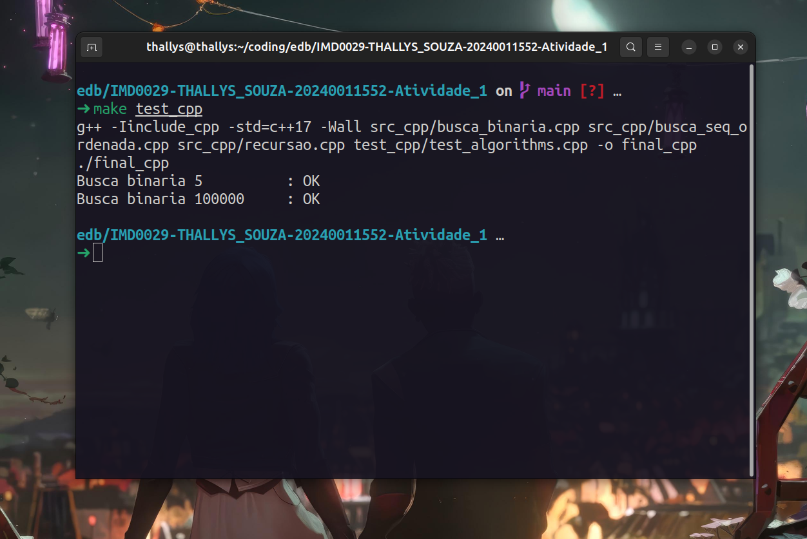
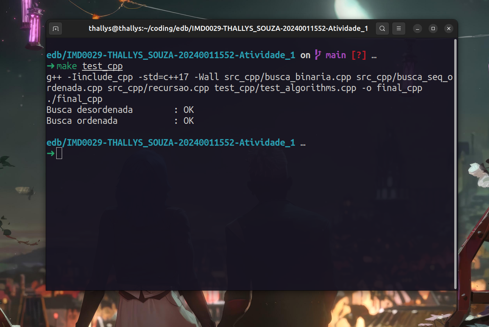
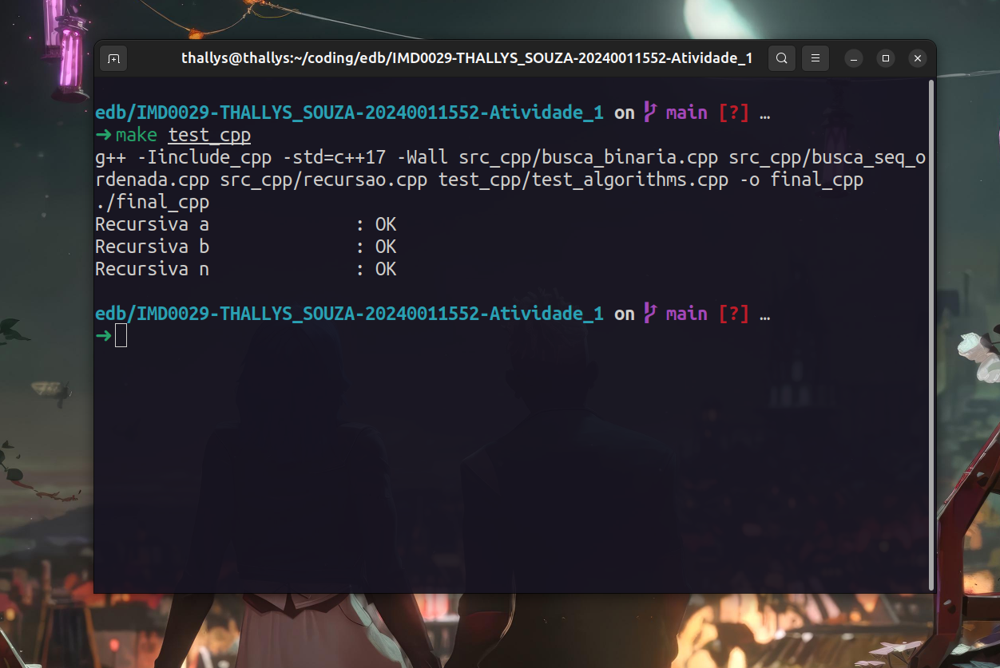
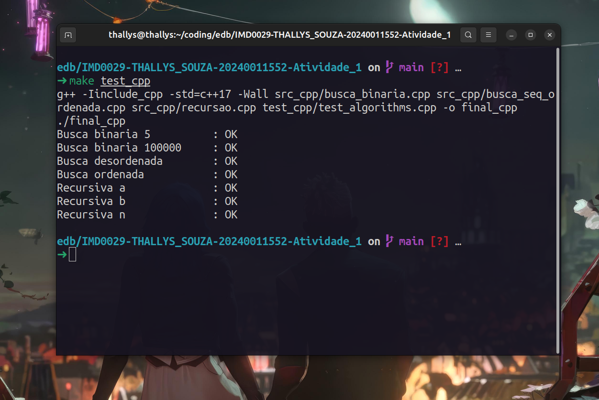

# Relatório das questões práticas a atividade 01

## 1) Primeira versão defeituosa

### Arquivos utilizados

- `include_cpp/busca_binaria.hpp`
- `src_cpp/busca_binaria.cpp`

### Especificações da função de verificação

- **Nome:** isBadVersion
- **Parâmetros:**
  - int version: versão a ser analisada.
  - int bad: primeira versão a ser defeituosa.
- **Retorno:** (bool) Verifica se a versão está no range de defeituosas (ou é a bad ou suas subsequentes)

- **Código:**

```cpp
// Apenas simulação para testes
bool isBadVersion(int version, int bad)
{
    return version >= bad;
}
```

---

### Especificações da função de Binary Search

- **Nome:** busca_binaria
- **Parâmetros:**
  - int n: o número total de versões.
  - int bad: primeira versão a ser defeituosa.
- **Retorno:** (int) O número da primeira versão defeituosa

- **Código:**

```cpp
int busca_binaria(int n, int bad)
{
    int left = 1;
    int right = n;
    while (left < right) // Se itera até que left == right
    {
        int mid = left + (right - left) / 2;
        if (isBadVersion(mid, bad))
        {
            right = mid; // Pode ser a primeira bad version
        }
        else
        {
            left = mid + 1; // Bad está à direita
        }
    }
    return left; // Ou right, pois left == right
}
```

---

### Testes

```cpp
//Linhas 25 e 26 do test_cpp/test_algorithms.cpp
RUN_TEST("Busca binaria 5", busca_binaria(5, 4), 4);
RUN_TEST("Busca binaria 100000", busca_binaria(100000, 10), 10);
>>> Busca binaria            : OK
>>> Busca binaria            : OK
```



---

## 2) Equipes iguais e diversas

### Arquivos utilizados

- `include_cpp/busca_seq_ordenada.hpp`
- `src_cpp/busca_seq_ordenada.cpp`

### Especificações da função de Bubble Sorting

- **Nome:** bubblesort
- **Parâmetros:**
  - vector(int) arr: array a ser ordenado.
  - bool reverse: flag que verifica a ordenação a ser feita (crescente como default).
- **Retorno:** (void) Após chamada da função, o array já estará ordenado
  
- **Código:**

```cpp
void bubblesort(vector<int> &arr, bool reverse = false)
{
    size_t size = arr.size();
    bool swapped;
    for (size_t i = 0; i < size - 1; i++)
    {
        swapped = false;
        for (size_t j = 0; j < size - i - 1; j++)
        {
            if ((reverse && arr[j] < arr[j + 1]) || (!reverse && arr[j] > arr[j + 1]))
            {
                swap(arr[j], arr[j + 1]);
                swapped = true;
            }
        }
        if (!swapped)
        {
            break;
        }
    }
}
```

Time complexity: O(n²)
Primeiro se instancia o tamanho do array para facilitar a leitura, junto com uma flag de verificação se a iteração ainda precisa de trocas, caso não, se interrompe a iteração atual para poupar tempo.

Se percorre o array verificando dois elementos por vez e, caso eles estiverem desordenados (em consonância com a flag reverse passada na função) são trocados de posição com a função `swap()`.

---

### Especificações da função de Partitioning

- **Nome:** partition
- **Parâmetros:**
  - vector(int) arr: array a ser ordenado.
  - int left: ponteiro para o primeiro valor analisado do array.
  - int right: ponteiro para o último valor analisado do array.
  - bool reverse: flag que verifica a ordenação a ser feita (crescente como default).
- **Retorno:** (int) Índice final do pivô, que será utilizado para dividir o vetor e aplicar a função quicksort recursivamente
  
- **Código:**

```cpp
int partition(vector<int> &arr, int left, int right, bool reverse = false)
{
    int pivot = arr[right]; // Escolhe o último elemento da sublista como o pivô.
    int i = left - 1; // índice que vai separar os menores (ou maiores, se reverse) do pivô

    // Varre o subvetor de left até right - 1, trocando os valores de lugar caso seja necessário
    for (int j = left; j < right; j++)
    {
        bool condition = reverse ? (arr[j] >= pivot) : (arr[j] <= pivot);
        if (condition)
        {
            i++;
            swap(arr[i], arr[j]);
        }
    }

    swap(arr[i + 1], arr[right]); // Coloca o pivô no seu lugar correto
    return i + 1;
}
```

Parte central do algoritmo de Quick Sorting. Organiza os elementos do vetor em torno de um "pivô" de modo que à esquerda do pivô fiquem os elementos menores (ou maiores, se reverse=true) que ele, e à direita fiquem os elementos maiores (ou menores, se reverse=true).

---

- **Nome:** quicksort
- **Parâmetros:**
  - vector(int) arr: array a ser ordenado.
  - int left: ponteiro para o primeiro valor analisado do array.
  - int right: ponteiro para o último valor analisado do array.
  - bool reverse: flag que verifica a ordenação a ser feita (crescente como default).
- **Retorno:** (void) Após a chamada da função, o array passado será ordenado
  
- **Código:**

```cpp
void quicksort(vector<int> &arr, int left, int right, bool reverse = false)
{
    // Passo "base", verifica a negação do passo base, quando não há mais de um elemento para ordernar no array analisado
    if (left < right)
    {
        int pi = partition(arr, left, right, reverse); // Chama a função partition
        // Aplicação recursiva do quicksort para a parte da esquerda e direita do pivô
        quicksort(arr, left, pi - 1, reverse);
        quicksort(arr, pi + 1, right, reverse);
    }
}
```

Time complexity: O(n log n)

A função quicksort organiza um subarray chamado partition e depois se chamando recursivamente até ordenar o array por inteiro. O pivô divide o vetor em dois lados, e cada lado é ordenado separadamente, de acordo com a flag `reverse`, que permite que a ordenação seja crescente (padrão) ou decrescente.

---

### Especificações da função de Ordered Linear Searching

- **Nome:** busca_seq_ordenada
- **Parâmetros:**
  - vector(int) arr: vetor a ser analisado.
  - int key: valor chave a ser buscado.
- **Retorno:** (int) Retorna o índice do valor procurado, caso não ache, retorna -1
  
- **Código:**

```cpp
int busca_seq_ordenada(const vector<int> &arr, int key)
{
    for (size_t i = 0; i < arr.size(); i++)
    {
        if (arr[i] == key)
        {
            return i;
        }
        else if (arr[i] > key)
        {
            return -1;
        }
    }
    return -1;
}
```

Em esquema de iteração, passa por todos os elementos do array verificando se são ou não iguais a chave passada, caso sim, retorna seu índice. Caso chegue ao fim do array e não tenha encontrado o valor chave ou o elemento analisado na iteração atual seja maior qu e a chave, retorna -1 (válido ressaltar que essa última condição de verificação de maior que só é possível por causa da natureza ordenada do vetor).

Vale salientar que essa não é nem a melhor forma de se fazer essa função, já que no contexto seria superior retornar apenas valores booleanos para condição de existência do valor, mas como foi pedido assim no exercício, deixei da forma exigida.

---

### Especificações da função de Contagem de especialidades

- **Nome:** conta_especialidades_distintas
- **Parâmetros:**
  - vector(int) arr: vetor a ser analisado.
- **Retorno:** (int) Retorna o número de especialidades distintas
  
- **Código:**

```cpp
int conta_especialidades_distintas(vector<int> &arr)
{
    // Ordenando o array para funcionamento do algoritmo de busa
    quicksort(arr, 0, arr.size() - 1, false); 
    // Inicialização de um vetor auxiliar que vai guardar as especializações distintas
    vector<int> distintos;
    for (size_t i = 0; i < arr.size(); i++)
    {
        // Verificação se é um novo valor no vetor de especialidades distintas
        if (busca_seq_ordenada(distintos, arr[i]) == -1)
        {
            distintos.push_back(arr[i]); // Adiciona o valor novo no array de distintos
        }
    }
    // Retorna o tamanho do array de especialidades (ou seja, o número de especialidades distintas)
    return distintos.size(); 
}
```

---

### Testes

```cpp
    vector<int> arr1 = {4, 2, 1, 4, 2, 1}
    vector<int> arr2 = {1, 2, 3, 4, 5, 6, 7, 8}
    RUN_TEST("Busca (des)ordenada", conta_especialidades_distintas(arr1), 3);
    RUN_TEST("Busca ordenada", conta_especialidades_distintas(arr2), 8);
>>> Busca desordenada        : OK
>>> Busca ordenada           : OK
```



---

## 3) Contagem recursiva

### Arquivos utilizados

- `include_cpp/recursao.hpp`
- `src_cpp/recursao.cpp`

### Especificações da função de recursão

- **Nome:** recursao
- **Parâmetros:**
  - string str: string a ser analisada.
  - char alvo: caracter a ser contabilizado.
- **Retorno:** (int) Número de vezes que o char `alvo` for encontrado na string

- **Código:**

```cpp
int recursao(const std::string &str, char alvo)
{
    if (str.empty())
    {
        return 0;
    }
    return (str[0] == alvo ? 1 : 0) + recursao(str.substr(1), alvo);
}
```

O workflow segue os padrões de algoritmos recursivos, definindo o caso base (no exercício o caso base seria quando a string analisada for vazia), e o passo recursivo.

O passo recursivo se dá primeiro pela verificação do primeiro char da string, caso ele for igual ao caracter alvo, é somado um ao valor retornado e, logo em seguida, faz uma chamada recursiva da função, porém com uma substring da original, ignorando o primeiro caracter.

---

### Testes

```cpp
    RUN_TEST("Recursiva a", recursao("banana", 'a'), 3);
    RUN_TEST("Recursiva b", recursao("banana", 'b'), 1);
    RUN_TEST("Recursiva n", recursao("banana", 'n'), 2);
>>> Recursiva a              : OK
>>> Recursiva b              : OK
>>> Recursiva n              : OK

```




